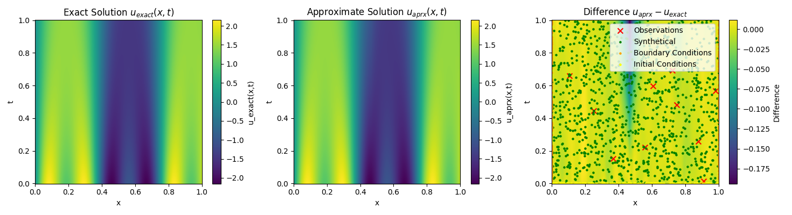
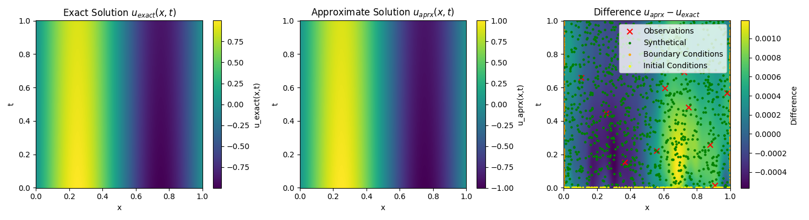
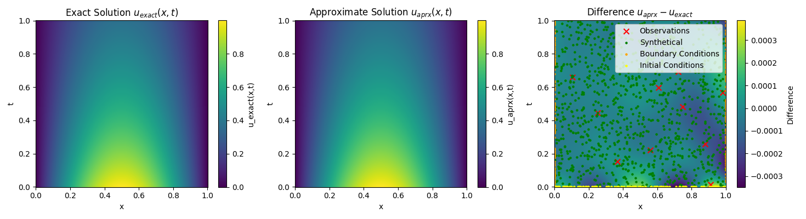
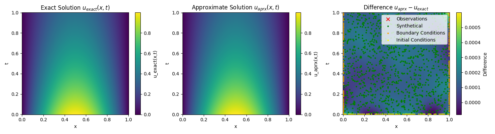

# pinn-1d-heat

This repository contains a draft implementation of a Physics-Informed Neural Network (PINN) for the one-dimensional heat equation with a trigonometric initial condition. To better capture high-frequency spatial behavior, Fourier feature embeddings are applied in the spatial dimension. From the fourth and fifth figures, it can also be observed that PINNs perform well even without incorporating observational data.

